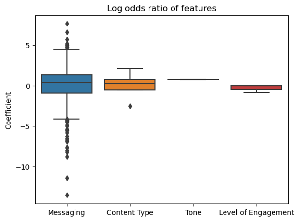
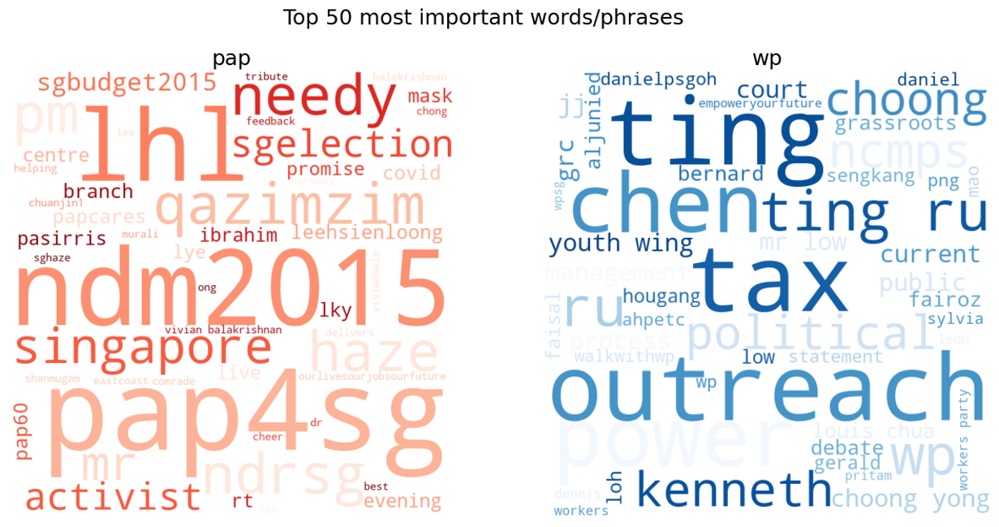

# Project 3: Evidence-Based Political Analysis in the Age of Social Media

**Primary Objectives:**

1. Scrape tweets from two Twitter accounts
2. Use NLP to train a classifier to predict the account a given tweet comes from (i.e. binary classification)

----

## Problem Statement

As a political analyst, the factors that best differentiate the 2 political parties' tweets are important in understanding the engagement approach  of the parties and the differences in political philosophies. Based on this understanding, if given an unlabelled tweet, would the analyst be able to discern from the Twitter accounts of 2 political parties the tweet is from?

Political analysts frequently need to dissect and analyse the different stances that political parties take for similar issues. Today, many political analysts still rely on qualitative analysis. The findings from our model will hopefully be useful for analysts by supplementing their qualitative analysis with quantitative results.

We will build a NLP binary classifier with explanatory and predictive power to attempt to predict whether a given tweet comes from 2 of Singapore's political parties, namely the @PAPSingapore and the @WPSG.

----

## Background & External Research

Political parties tend to talk about similar things, e.g., government policy, national security etc. Based on personal experience, anecdotal evidence and ChatGPT3, the tweets from different political parties (loosely based on those in the U.S.) can differ by a few key aspects despite being similar in content, namely:
- **Messaging** - messaging usually reflects the party's ideology, values and priorities. For instance, conservative parties may emphasise on lower taxes, greater individual freedom and smaller government (e.g., Republicans in the U.S.) while liberal parties may emphasise on social justice, government intervention (e.g., Democrats in the U.S.). The type of messaging can also be proxied by the hashtags commonly used by the account
- **Tone** - this can range from aggressive to conciliatory even if the content is similar (e.g., talking about the same topic), depending on the party's political objective
- **Content Type** - Depending on the target audience, political parties may use different types of content that resonate better with the intended target audience. For example, political parties that tend to target younger voters may use more trendy language and memes.
- **Frequency** - some political parties may tweet more often if the majority of voters are on Twitter. We will not use this in our classifier as frequency is not a valid characteristic of an individual tweet as defined in this problem statement.
- **Level of Engagement** - some political parties may more readily engage their followers by replying to comments, mentioning users or retweeting to amplify messages from supporters.

These key aspects may be present in the tweets of Singapore's political parties as well, albeit to different extents compared to the U.S. As such, we may be able to differentiate the tweets from different political parties by looking at these aspects of their tweets.

In testing this hypothesis, we choose Singapore's 2 largest political parties (based on number of seats in Parliament), and examine their tweets. These are:
|  |  |
|-------------|--------------|
| 
 **People's Action Party (PAP)** [@PAPSingapore](https://twitter.com/PAPSingapore)
 | 
 **The Workers' Party (WP)** [@WPSG](https://twitter.com/wpsg?lang=en)
 |

----
## Dataset

The Tweets dataset contains the tweets and attributes of the tweets from both political parties from 2010 to 2022. The dataset is in the `datasets` folder.

----
## Technical Report

The technical report is split into 4 parts in the `code` folder.

In addition to the Jupyter notebooks, there are 2 python scripts that contain user-defined functions to aid in the data cleaning and analysis.

----
## Findings and Conclusions

### Selection of model metric
For model evaluation, there are many metrics that can be used. For this problem statement, we will use average F1 score to provide a balance between precision and recall. This is because:
1. The dataset is quite balanced between the 2 Twitter accounts
2. Classifying the tweet wrongly either way is equally detrimental

Hence, we will not prioritise precision or recall but aim to get the best F1 score instead.

### Model tuning and evaluation

We tested and tuned 3 models through a training dataset with 5-fold cross validation and then the test dataset as a barometer to evaluate their performance. The summary of performance of various models is summarised below.

| Model | Training Avg F1 Score | 5-Fold Cross Val Avg F1 Score | Test Avg F1 Score |
| :- | -: | -: | -: |
| Baseline | 0.337 | - |  |
| **Messaging Only** |  |  |  |
| Naive Bayes Simplified | 0.950 | 0.925 | 0.919 |
| Random Forest Simplified | 0.967 | 0.918 | 0.914 |
| Logistic Regression Simplified | 0.968 | 0.925 | 0.921 |
| **All Aspects** |  |  |  |
| Naive Bayes | 0.924 | 0.902 | 0.917 |
| Random Forest | 0.937 | 0.918 | 0.925 |
| Logistic Regression | 0.974 | 0.939 | 0.941 |

After analysing the wrong predictions, we note that most of these predictions are difficult even for humans to differentiate. This is because of 
1. Lack of information due to the general nature of the tweet
2. Additional information embedded within the photos/videos/weblinks which the current models cannot extract

As such, we choose the full **Logistic Regression model** for further business insights.

### Business Insights

- **Messaging** features have the greatest impact on the log odds ratio of identifying the account the tweet is from
- **Content type** features are the next most impactful, specifically the presence of a weblink increases the log odds ratio of the account being PAP by 2x while the presence of a GIF increases the ratio of the account being WP by 2.6x
- **Tone** of the tweet has a smaller impact and a positive tone generally increases the odds of the account being PAP. This means that PAP's tweets tend to be more positive
- **Level of Engagement** features generally increases the odds of the tweet being from WP. This means that WP's tweets tend to have greater levels of engagement

Specifically on **Messaging** features, we note that PAP's tweets tend to reference the party (e.g. pap4sg) and PM (e.g. lhl, pm), while WP's tweets similarly reference their MPs (e.g., He Ting Ru, Fairoz, Sylvia) and constituencies (e.g. Sengkang, Hougang, AHPETC)
- PAP's tweets raise key events such as ndm2015, ndrsg. Similarly, WP's tweets focuses on political activities related to them, specifically outreach, grassroots and youth wing
- In terms of policy interests unique to each account, PAP's tweets tend to raise the needy more while WP's tweets focuses on poweer (a.k.a. people's power) and tax

### Conclusion and Future Work

- While the classification model is not perfect, it provides a good predictor for identifying which political party's Twitter account a tweet belongs to
- More importantly, the model tells us why, in the terms of the messaging, content type, tone and enagement level
- Examining these details can enable political analysts to better understand the unique interests, philosophies and approach of each party
- Further improvements to the model such as additional new information about the multimedia attachments can further improvement the model performance
- The utility of this project goes beyond that for political analysts. Building on this understanding, political parties can modify the model's outcome variable to suit their objectives, e.g. optimise engagement rates by examining what features in the messaging increases engagement the most